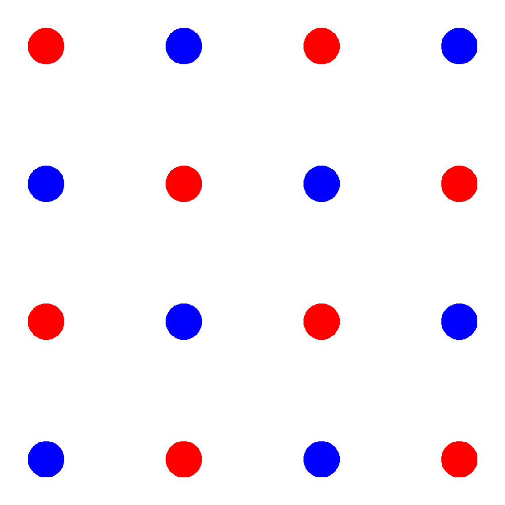

# Regulation Evolution

This is a CPM model developed to investigate and characterize the emergence of multicellularity.

For a publication describing a previous version of this model, refer to [Colizzi et al. 2020](https://doi.org/10.7554/eLife.56349)

## Project dependecies

- libpng
- X11
- Cmake
- Python and some packages

libpng and X11 are installed in most linux distros, so no need to worry about them.

Cmake and the python dependencies are pinned in the file "environment.yml", 
which can be used to recreate the development environment by first installing conda and then running
`conda env create -f environment.yml`. 

The python dependencies are optional. They are used to generate the plots and the competition files,
but the simulations themselves do not depend on them.

## Building the project

1. Create the build directory in the main project folder and cd into it:  
`mkdir ./build; cd build`
2. Run cmake (you can use "-DCMAKE_BUILD_TYPE" to choose between a debug or a release build):  
`cmake .. -DCMAKE_BUILD_TYPE=Release`
3. Build the project with `make`:  
`make`
4. The executable targets will be built and added to the folder "bin".

## Python CLI

> Note: this functionality requires the [python dependencies](#project-dependecies) to be installed

Easy access to all scripts to analyze simulation data and create competition files 
is available through a python command line interface that can be found in the "bin" folder of the project.

To see what utilities are available, first activate your conda environment and than run:

`python bin/run_script.py -h`

## Running simulations

After building the project, you can execute the simulations by running the project's main target:

1. Cd into bin from the main project folder:  
`cd bin`
2. Execute the "cell_evolution" file, giving it as parameters the path to a simulation 
parameters file and a "name" for the run (the directory where the simulation files will be created):  
`./cell_evolution <path_to_par_file> -name <path_to_run_directory>`
   1. The "-name" parameter should point to an empty existing directory ending in a "/" character.
   2. `-name path/to/run/` instead of `-name path/to/run`, for example.

### Example

You should be able to run this fresh after cloning the repo, so you can use this code to test that the build
is working as expected.

From the main project directory:

1. Make a directory for the run:  
`mkdir -p runs/debug`
2. Run the main executable with the shipped parameter file "cell_evolution.par":  
`cd bin`  
`./cell_evolution ../data/cell_evolution.par -name ../runs/debug/`

## Restarting simulations from backup

We save backup files every so often to ensure that the simulations can be recovered if the process
halts for some reason. These files are also used to analyze and plot information about the simulations.

By default (can be changed with parameters):

- Cell information is saved in `path/to/run/celldata_`
- Cell death information is saved in `path/to/run/cellgravedata_`
- Food information is saved in `path/to/run/fooddata_`
- Lattice information is saved in `path/to/run/lattice_`

To start a simulation from a backup, you will need to provide the program a cell data file and a lattice file
dating from the same time-step in the simulation.

Additionally, you can provide a food data file to ensure that the food patches will be in the same 
position as before.

To then restart the simulation:

`./cell_evolution <path_to_par_file> -name <path_to_run_directory> -celldatafile <path_to_cell_data_file> -latticefile <path_to_lattice_file> [-fooddatafile path_to_food_file]`

### Competition simulations

> Note: to start competition simulations, the [python dependencies](#project-dependecies) are required

Starting a competition simulation is essentially the same as starting a simulation from backup.

The difference is that instead of using raw backup files from a previous simulation to start the new one,
we must make our own.

#### Template file

First, you need to make a cell template file. These describe which cells we will compete against each
other in the simulation.

The format of this file is the same as that of the backup cell data files, except that the "group"
attribute of cells will be used to determine which of the competing groups they belong to.

In most cases, you will want to: 

1. Create a new CSV file to be the template file.
2. Take a few rows of cells from a simulation backup file and copy them to the new template file, setting their "group"
attribute to be all 0.
3. Do the same with cells from a different simulation, setting their "group" attribute to 1.
4. Set the "food" attribute of all cells to be the same, ensuring that no one is at an advantage. 

To simplify this process, we provide a utility tool through the [python CLI](#python-cli).

To see help about the program, run:

`python bin/run_script.py make_templates -h`

#### Competition setup image

To describe how the cells will be arranged in the lattice before the simulation starts, you must create
an image of the field.

The format specification for this image file is:

- Must be a PNG file.
- Must have the same size as the simulation lattice (so must match the "sizex" and "sizey" parameters in the par file).
- Must have a white background (not transparent)
- Must have the same width and height (rectangular lattices in general are not well tested, so disregard this at your own risk).

You can than draw on this image what the setup for the simulation should look like. 

Each pixel color corresponds to a different group of cells (those in the template file). You must
ensure that the drawings do not "fade" into the white background, as those would represent different colors
and be interpreted by the program as different cell groups.

Some image setups are shipped with the repo. They are available at the directory `data/competition`.

#### Competition files

These are the files that will be given to the main executable to start the competition run.

They can be generated

Build with CMake.

The project dependencies are listed in 'environment.yml'. You can use this file to create a 
conda environment containing the dependencies. 

'run_script.py' is a CLI python application to execute the scripts contained in the 
'scripts' package. Run ``python run_script -h`` for help.
